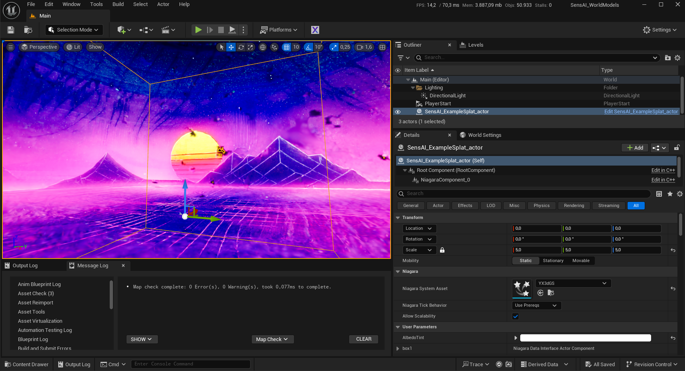
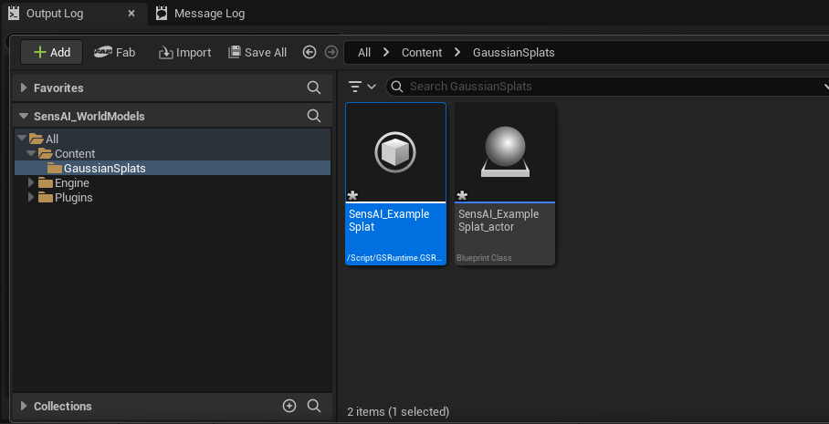
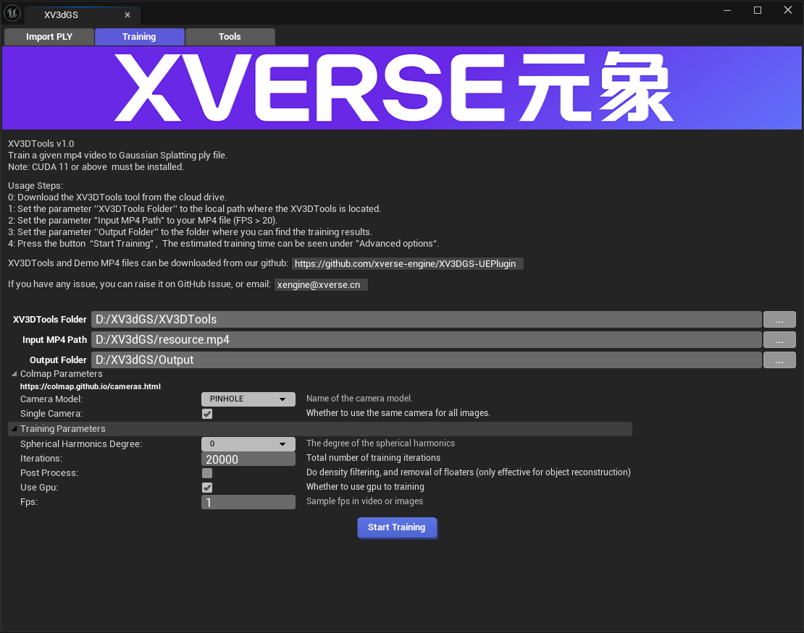

# sensai-unreal-worldmodels

Unreal Engine 5.5 template project for rendering Gaussian splats using the XVERSE XV3DGS plugin.

## Getting Started

Prerequisites: Unreal Engine **5.5**

> **Important:** The XV3DGS plugin is **not compatible with Unreal Engine versions beyond 5.5**.

1. Clone this repository.
2. Open `SensAI_WorldModels.uproject` in UE 5.5.
3. The XV3DGS plugin is included under `Plugins/XV3dGS` and will be enabled automatically.

### Render Settings

Hardware Ray Tracing is **disabled** in the project settings — it is incompatible with Gaussian splat rendering via XV3DGS due to shader compilation errors.

## Gaussian Splats / XV3DGS Plugin

Import `.ply` files directly through the XV3DGS editor tab, this produces two files: the converted splat and a Blueprint that you can place in your level.

The plugin also includes a training tool that converts `.mp4` video into `.ply` splat files (requires CUDA 11+).

3D Gaussian Splatting rendering plugin for Unreal Engine by [XVERSE](http://www.xverse.cn/).

- **GitHub:** https://github.com/xverse-engine/XV3DGS-UEPlugin
- **Version:** 1.1.5.1
- **Platform:** Win64

## Acknowledgements & Credits

Powered by [SensAI Hackademy](https://sensaihackademy.com/).

Gaussian splat rendering by [XVERSE XV3DGS](https://github.com/xverse-engine/XV3DGS-UEPlugin) — full credit to the XVERSE team.
